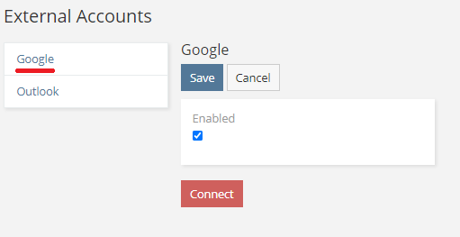

# Google Integration. Contacts

[Google Integration](https://www.espocrm.com/extensions/google-integration) provides the ability to sync calendar events in both directions.

Features:

* Ability to push your EspoCRM contacts and leads to Google Contacts
* Ability to choose Google Contacts groups
* Available fields: *Name*, *Description*, *Email Addresses*, *Phone Numbers*, and *Account Name*

## Setting-up for users

Assuming, that the administrator has already set up the integration.

Go to your user detail view (the menu on the very top-right corner > click on your user name). Then click *External Account* button.

Click *Google* on the left panel, check *Enabled* checkbox and then click *Connect* button.

A popup will show up asking for a user consent.

If everything went fine, a green label *Connected* should show up.

**Important**: If you succesfully connected, but *Google Contacts* checkbox didn't show up, that mean that the administrator did not grant you an access to *Google Contacts* scope.

Check *Google Calendar* checkbox. You can select *Google Contacts Groups*, to which EspoCRM records will be pushed.

After that, you need to click *Save*.

## Pushing to Google

Go to Contacts or Leads list view, select needed items, then click *Actions* dropdown and click *Push to Google*.

A single portion can contain up to 10 records. The rest will be pushed in idle mode (by cron).

After that you can find your contacts in Google.
