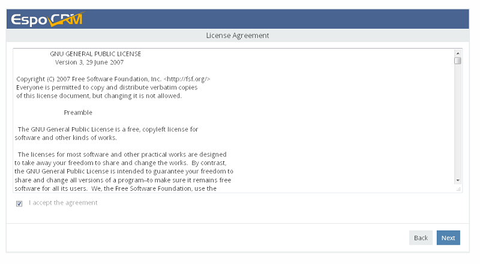
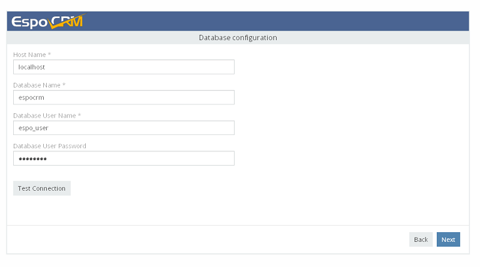
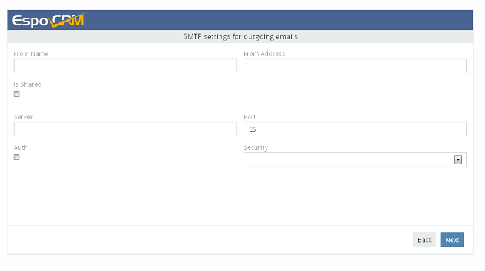
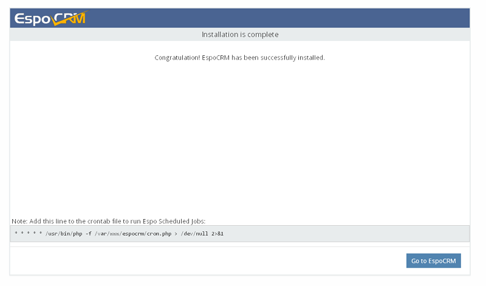

# Instalación

### Requisitos
EspoCRM se ejecuta en la mayoría de los proveedores de alojamiento. Los requisitos incluyen lo siguiente:

* PHP 5.5 o la última versión de PHP con habilitado pdo, json, biblioteca GD, extensiones mcrypt (generalmente habilitadas por defecto);
* MySQL 5.1 o superior.

Consulte el artículo [Configuracion del servidor](server-configuration.md) para más información.

### 1. Descargue el paquete de instalación de EspoCRM
Para obtener la última versión de EspoCRM, siga el enlace [descargar página](http://www.espocrm.com/download/).

### 2. Cargue los archivos de EspoCRM a su servidor

Una vez que se completa la descarga, suba el paquete a su servidor web.
Para subirlo, puede usar SSH, FTP o el panel de administración de hosting.
Extraiga el archivo a su directorio público del servidor web (por ejemplo, `public_html`,` www`, etc.).

_Nota: para FTP, necesita extraer el archivo antes de cargarlo en su servidor web._

### 3. Crear una base de datos MySQL para que EspoCRM use

Vaya a su panel de administración de hosting, o a SSH, y cree una nueva base de datos y usuario para EspoCRM (por ejemplo, `Bases de datos MySQL` en cPanel).

### 4. Ejecute el proceso de instalación de EspoCRM

Ahora, abra su navegador web y vaya a la URL con los archivos de EspoCRM (Por ejemplo, `http://yourdomain.com/espo`).

Si ve esta pantalla, tiene un error "Permiso denegado".
Por lo tanto, debe ejecutar el comando que se muestra en el terminal a través de SSH o establecer el permiso correcto.
Debe ser 755 para directorios, 644 para archivos y 775 para directorio `datos`.
También asegúrese de tener el _owner_ y _group_ correcto.

Si ve la siguiente pantalla, el permiso es correcto y puede comenzar a instalar EspoCRM.

En esta página, puede leer y aceptar el Acuerdo de licencia.

Ingrese los detalles de su base de datos MySQL recién creada.

Ingrese el nombre de usuario y la contraseña del administrador EspoCRM.

En esta página puede establecer la configuración predeterminada de EspoCRM, como el formato de fecha y hora, la zona horaria, la moneda y otros.

Ingrese la configuración de SMTP para los correos electrónicos salientes, si desea tener la capacidad de enviar correos electrónicos.
Este paso se puede omitir haciendo clic en el botón _Next_.
Todas estas opciones se pueden agregar / cambiar en EspoCRM después de la instalación.

¡Felicidades! La instalación esta completa.
Lo último para configurar las tareas programadas para que las ejecute su sistema. Se puede hacer ejecutando `crontab -e` en linux cli y en _Windows Tasks Scheduler_ en sistemas Windows.

Esperamos que disfrute trabajando en EspoCRM.
