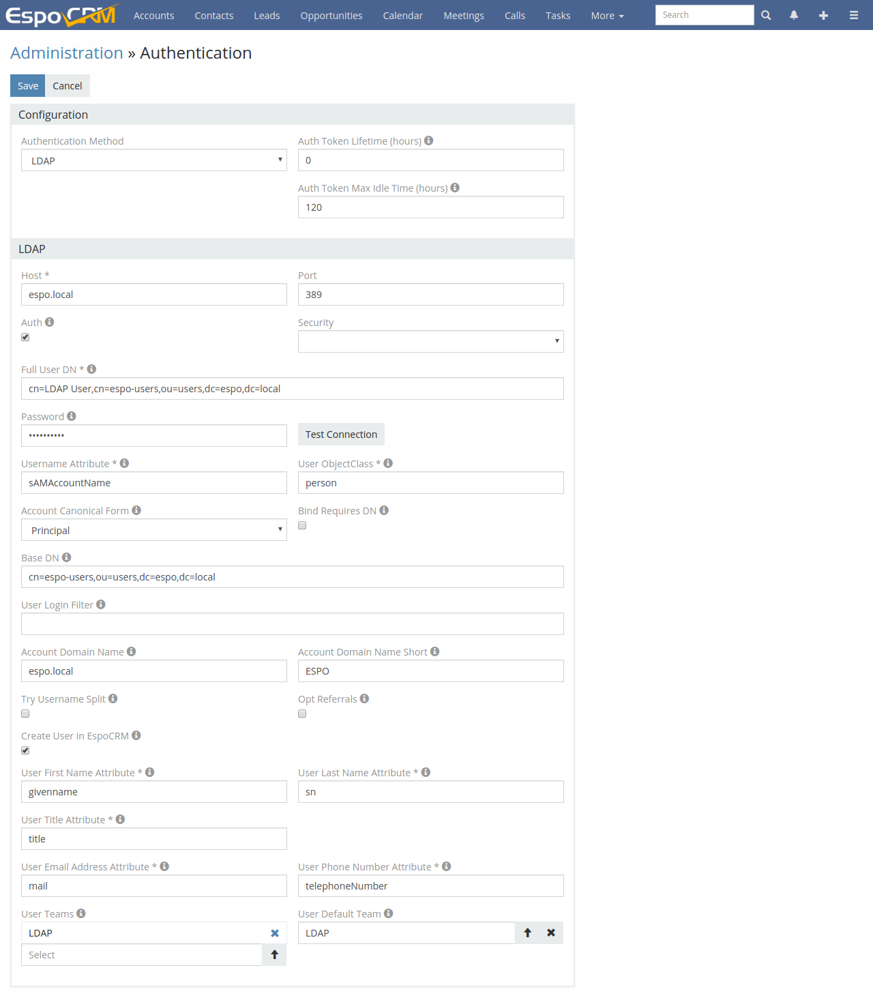

# Autorización Ldap

En esta guía, le mostraremos cómo configurar la autorización de LDAP para EspoCRM. Vamonos.

Vaya a su servidor LDAP y cree un DN base para los usuarios de EspoCRM
```
cn=espo-users,ou=users,dc=espo,dc=local
```

Tenemos que crear un usuario del sistema que tendrá acceso a los usuarios DN (“cn=espo-users,ou=users,dc=espo,dc=local”). Entonces, el DN completo para este usuario del sistema será
```
cn=LDAP User,cn=espo-users,ou=users,dc=espo,dc=local
```
Ahora, podemos agregar usuarios de LDAP para acceder a EspoCRM. por ejemplo. Espo Tester con el nombre de usuario "tester" dentro de  “cn=espo-users,ou=users,dc=espo,dc=local” DN. Tenga en cuenta: para poder utilizar este formato de inicio de sesión para EspoCRM, debe especificar las opciones "Nombre de usuario" y "DN base".

A continuación, vaya a la configuración de Autenticación de EspoCRM en el panel Administrador, seleccione el método `LDAP` y complete los detalles de LDAP:



* Host: IP de LDAP o nombre de host.
* Puerto - puerto de conexión.
* Auth: credenciales de acceso para el servidor LDAP:
  * DN de usuario completo: el DN de usuario del sistema completo que permite buscar a otros usuarios.
  * Contraseña: la contraseña para acceder al servidor LDAP.
* Seguridad: protocolo SSL o TSL.
* Atributo de nombre de usuario: el atributo para identificar al usuario. Para Active Directory puede ser "userPrincipalName" o "sAMAccountName".
* Formulario canónico de la cuenta: tipo de formulario canónico de su cuenta. Hay 4 opciones:
  * Dn - la forma en el formato `CN = probador, CN = Espocrm, DC = compañía, DC = com`.
  * Nombre de usuario - el formulario `probador`.
  * Barra diagonal: el formulario `COMPAÑÍA \ probador`.
  * Principal - el formulario `tester @ company.com`.
* Enlace Requiere Dn - si es necesario formatear el nombre de usuario en el formulario DN.
* Base Dn: el DN base predeterminado que se utiliza para buscar usuarios.
* Filtro de inicio de sesión de usuario: el filtro que permite restringir a los usuarios que pueden usar EspoCRM. Por ejemplo. `memberOf = cn = espoGroup, cn = espo-users, ou = usuarios, dc = espo, dc = local`.
* Nombre de dominio de la cuenta: el dominio que se utiliza para autorizar el servidor LDAP.
* Nombre de dominio de cuenta corto: el dominio corto que se utiliza para autorizar el servidor LDAP.
* Pruebe el nombre de usuario dividido: la opción de dividir un nombre de usuario con el dominio.
* Opt Referencias - si las referencias deben seguirse al cliente LDAP.
* Crear usuario en EspoCRM: esta opción permite a EspoCRM crear un usuario desde LDAP.
  * Atributo del nombre del usuario: atributo LDAP que se utiliza para determinar el nombre del usuario.
  * Atributo del apellido del usuario: atributo LDAP que se utiliza para determinar el apellido del usuario.
  * Atributo de título de usuario: atributo LDAP que se utiliza para determinar el título del usuario.
  * Atributo de dirección de correo electrónico de usuario: atributo LDAP que se utiliza para determinar la dirección de correo electrónico del usuario.
  * Atributo del número de teléfono del usuario: atributo LDAP que se utiliza para determinar el número de teléfono del usuario.

Ahora, vaya a la página de inicio de sesión e ingrese las credenciales de usuario.


El usuario ha sido autenticado y creado automáticamente en el EspoCRM.

## Instrucciones de configuración basadas en su servidor:
* [Servidor de Active Directory](ldap-authorization-for-ad.md)
* [Servidor OpenLDAP](ldap-authorization-for-openldap.md)

Puede obtener más información sobre la configuración de LDAP en la página [Biblioteca Zend \ Ldap](https://zendframework.github.io/zend-ldap/intro/), ya que EspoCRM utiliza esta biblioteca.
