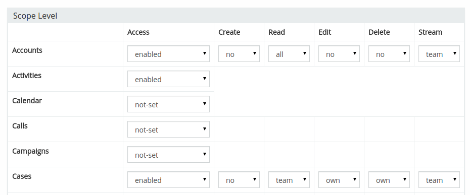

# Peran Manajemen

## Ikhtisar

Untuk membatasi akses bagi beberapa pengguna, Anda perlu menggunakan Peran. Administrator dapat mengelola peran di panel Administrasi. Setiap peran mendefinisikan akses ke area tertentu (cakupan) yang diterapkan pada pengguna yang memiliki peran tersebut.

Satu pengguna dapat memiliki banyak peran. Peran tersebut dapat dipilih untuk pengguna tertentu (bidang 'Peran' di entri Pengguna) dan/atau diwarisi dari tim yang menjadi milik pengguna.

Jika pengguna memiliki banyak peran maka mereka akan digabungkan sehingga aturan permisif akan memiliki prioritas lebih tinggi. Itu memungkinkan administrator mengatur kontrol tingkat akses dengan mudah dan fleksibel.

Anda dapat melihat izin apa yang diterapkan pada pengguna tertentu dengan mengeklik tombol 'Akses' pada tampilan detail pengguna.



## Contoh

Misalnya, pengguna milik tim 'Penjualan'. Tim itu memiliki peran tunggal 'Penjual'. Jadi semua pengguna dari tim ini akan mendapatkan peran 'Penjual'.

Peran 'Penjual' didefinisikan sebagai berikut:

Judul:
```
buat – ya
baca – tim
ubah – sendiri
hapus – tidak
siaran – tim
```

Opportuniti:
```
buat – ya
baca – tim
ubah – sendiri
hapus – tidak
siaran – tim
```

Pengguna hanya dapat membaca prospek dan peluang yang dimiliki tim 'Departemen Penjualan' (bidang 'Tim').
Pengguna hanya dapat mengubah prospek dan peluang yang mereka tentukan atau yang telah mereka buat.
Pengguna tidak dapat menghapus prospek atau peluang apa pun.

Kami ingin memberikan lebih banyak hak kepada pengguna tertentu yang memegang posisi manajer penjualan di perusahaan. Karyawan ini harus memiliki kemampuan untuk membaca/mengubah/menghapus semua rekaman dari tim 'Penjualan'. Pengguna harus menjadi anggota tim 'Penjualan' kami. Namun, kami perlu membuat peran baru 'Manajer Penjualan' dan memilih peran ini untuk pengguna di bidang 'Peran'.

Peran 'Manajer Penjualan' didefinisikan sebagai berikut:

Judul:
```
buat – ya
baca – tim
ubah – tim
hapus – tim
siaran – tim
```

Opportunity:
```
buat – ya
baca – tim
ubah – tim
hapus – tim
siaran – tim
```

Our user will be able to manager all leads and opportunities from the ‘Sales’ team.

## Izin Khusus

### Izin Penugasan

Tetapkan parameter ini untuk membatasi kemampuan untuk menetapkan ulang catatan ke pengguna dan/atau tim lain. Jika Anda menetapkan `tim` - maka akan memungkinkan untuk menetapkan hanya kepada pengguna dari tim sendiri. Jika `no` - pengguna tidak akan dapat menugaskan kembali sama sekali.

Ini juga mendefinisikan apakah pengguna dapat mengirim ke pengguna lain/tim lain.

### Izin Pengguna

Memungkinkan untuk membatasi kemampuan pengguna untuk melihat aktivitas, kalender, dan arus pengguna lain.

### Izin Portal

Mendefinisikan akses ke informasi portal, kemampuan untuk mengirim pesan ke pengguna portal.

### Izin Akun Surel Grup

Mendefinisikan akses ke akun surel grup, kemampuan untuk mengirim surel dari grup SMTP.

### Izin Mengekspor

Mendefenisikan apakah pengguna memiliki kemampuan untuk mengekspor catatan. (sejak versi 4.9.0)

## Izin secara Default

Secara default (jika tidak ada pengguna yang diterapkan), pengguna dapat membaca dan mengedit semua catatan. Tetapi tidak dapat menghapus yang manapun kecuali yang telah mereka buat dan mereka ditugaskan pada saat bersamaan.

Ada kemampuan untuk membatasi akses yang diterapkan secara default dengan mengaktifkan 'Mode Strict ACL' di Administrasi> Pengaturan.

## Keamanan Tingkat Bidang

Memungkinkan untuk mengontrol akses untuk bidang tertentu.

Secara default user bisa membaca semua bidang jika seseorang bisa membaca rekaman. Pengguna bisa mengubah bidang mana pun jika bisa mengubah rekaman. Anda dapat membatasi akses ke bidang tertentu menggunakan Keamanan Tingkat Bidang.

Pada tampilan mengubah catatan peran di kolom Level Bidang klik ikon plus disebelah scope spesifik lalu pilih bidang yang dibutuhkan. Kemudian Anda akan dapat menentukan tingkat akses untuk tindakan `baca` dan `edit`. Ada pilihan: `yes` dan` no`.


